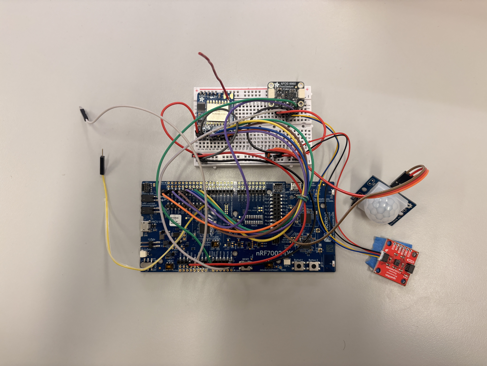
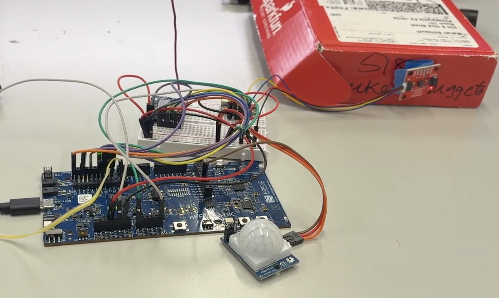
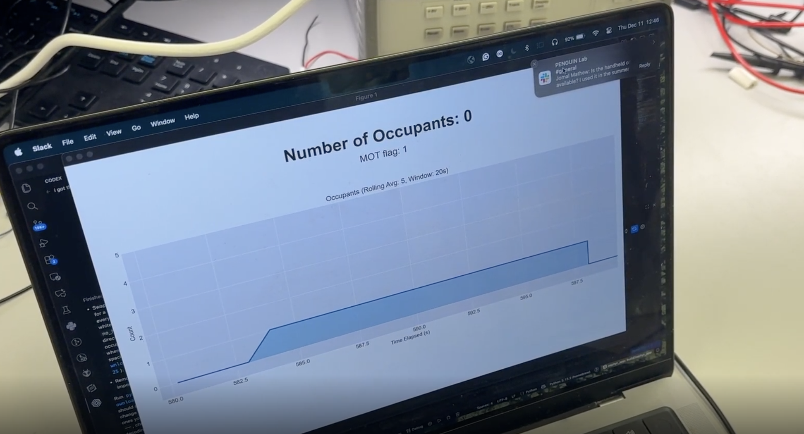
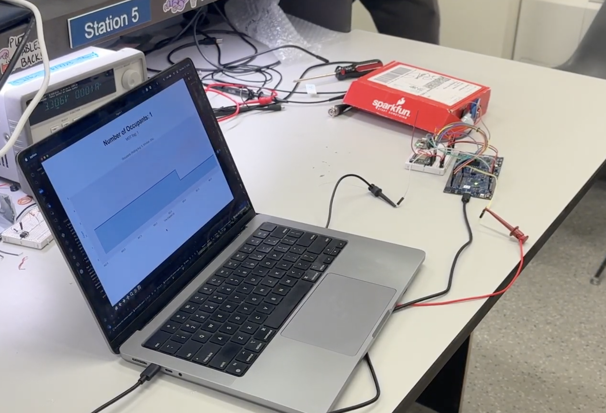
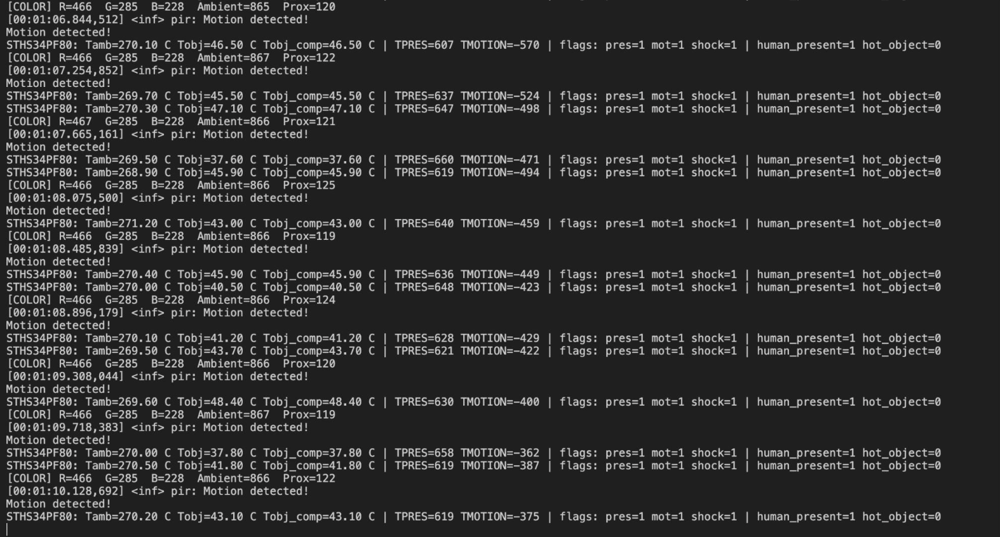
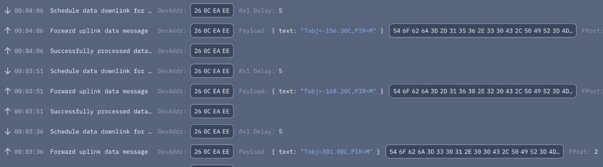
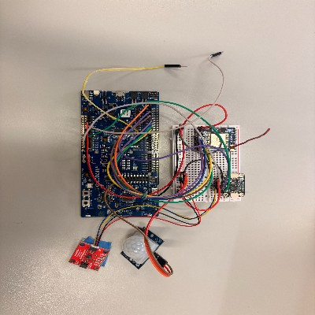

# IoT Venture Pitch

## ESE5180: IoT Wireless, Security, & Scaling

**Team Name: Chicken Nuggets**

| Team Member Name | Email Address           |
| ---------------- | ----------------------- |
| Rohan Panday     | <rpanday@seas.upenn.edu>  |
| Jason Li         | <jasonsli@seas.upenn.edu> |
| Nandini Swami    | <snandini@seas.upenn.edu> |

**GitHub Repository URL:** <https://github.com/ese5180/iot-venture-f25-chicken-nuggets#>

# Retrospective (Final Project Website Content)

## Successes

Some things that we would consider a success for our project are:

- LoRaWAN transport.
  - We are able to reliably and consistently transmit our data over LoRaWAN. We ran into plenty of issues early on with our LoRa transceiver setup, but with the help of our peers, professor, and plenty of research, we were able to ge the wireless transmission system completely working.

- Sensor readings.
  - We are able to achieve reasonably accurate results for determining occupancy using our sensors. We also ran into some initial issues setting up communication with all the sensors in the system, especially since we have multiple devices on the same I2C bus and needed to deal with concurrency. However, we were able to abstract concurrency issues away with the use of Zephyr RTOS threads.

- CI pipeline.
  - We have a working CI pipeline that we can use to validate any code that we push to our repo.

- Pitch and vision.
  - We articulated our vision, technical details, market analysis, and pricing model clearly and fluently during our pitch. We were able to address many of our investors' questions and concerns. The goal and scope of our product is clear and simple.

- Delegation of work and problem solving.
  - We split up our tasks well, taking each of our members' strengths into account. We were able to assign a roughly equal amount of work to each member of our team. We problem solved well as a group, meeting frequently together to address any large issues we ran into.

## Areas for Improvement

Some things that could've gone better while implementing our project are:

- More defined test criteria.
  - It would have been helpful to define what a successful product would have looked like before we started diving right in and implementing it. This would give us clear and concrete goals to move towards. If we had picked "checkpoints" or deliverable goals to move towards one at a time, we could have focused our efforts more clearly and moved faster.

- FOTA.
  - We ran into many issues while getting FOTA updates working. We tried two approaches:
    - AWS IoT, over LoRa
      - This ended up being our final solution. We weren't able to progress using this method until we had picked up a separate LoRa gateway than the one currently in Detkin (our one is AWS enabled). We struggled with unclear documentation, extremely slow iteration as LoRa OTAs take a long time to schedule and transmit, and unreliable transmission consistency (we would regularly lose about 50\% of our packets per OTA).
    - Memfault, over Wi-Fi
      - We tried this as an alternative solution when we were running into issues with LoRa FOTA updates. We constantly strugged with outdated documentation and code that didn't compile, excessive memory usage from the Wi-Fi stack on Zephyr, and conflicts with our existing LoRa stack. Debugging this took up much of our time that we wish was better spent on other features.

- Integration.
  - We had some trouble integrating our sensor systems and LoRa stack together, especially what data to transit and how often this would happen. It would have been helpful to start the integration process earlier so that we had more time to focus on polishing our solution.

## Development Approach

- We would start iterating with the sensors much earlier. We spent a large portion of the project focusing on LoRa communication and FUOTA, which were core goals of the class and technically challenging in their own right. While that focus made sense, it delayed work with the sensors themselves. Beginning sensor integration earlier would have exposed some of the practical issues sooner (such as the difficulty in getting useful readings from the color sensors).

- We would define the product use case more clearly from the start. Early on, we were not very specific about how the sensor would be mounted, what types of spaces it was intended for, or how different operating modes and thresholds should behave in software. That ambiguity made some development decisions feel speculative and led to rework later. A clearer, more concrete use case up front would have helped us prioritize features, tune parameters earlier, and make more confident design tradeoffs.

- We would invest more effort into building a robust physical setup earlier in the project. Loose jumper wires and fragile connections on the breadboard setup caused intermittent issues that slowed debugging and made it harder to distinguish software bugs from hardware problems. Even a simple mechanical enclosure or semi-permanent wiring solution would have saved time and reduced issues during testing and iteration.

- We would make our software design easier to integrate into a final project. While the thread setup was very beneficial in terms of creating a simple and readable codebase, it caused some issues downstream in terms of thread priority as well as integrations issues in terms of writing sensor readings from different threads into the LoRaWAN buffer. A system designed around the LoRaWAN transmission would have likely helped mitigate these issues.

- We would aim for more incremental, end-to-end milestones rather than large feature blocks. Getting a minimal “vertical slice” working early (sensor → processing → wireless → backend) would have made progress more visible and helped catch integration issues sooner. We would also budget more time for validation and characterization, rather than treating testing as something that happens mainly at the end.

## System Design

After completing this development cycle, we would make several changes to our system design.

Overall, we believe our choice of wireless communication protocol was the right one. Our device is intended to publish small, periodic summaries of data, so using a low-power protocol like LoRaWAN makes much more sense than a heavier, more energy-intensive Wi-Fi stack. That said, this project also made it clear that firmware update mechanisms over LoRa are inherently challenging. The small packet sizes, duty cycle limits, and downlink constraints make FOTA difficult to implement robustly and reliably. If this were a production system, we would simplify update requirements by pushing delta updates rather than the entire .bin file.

Also, as mentioned above, we would also revise our software architecture to better align with the communication pipeline. While our threading design helped keep the codebase modular and readable, it introduced complexity when integrating sensor data into the LoRaWAN transmission path. In particular, shared access to the transmission buffer became sources of bugs. A design more explicitly centered around the LoRaWAN uplink cycle would likely reduce issues. Furthermore, a more event-driven or message-queue-based architecture would have been a better fit for this system.

The color sensor proved difficult to get consistent, meaningful readings from, especially given sensitivity to ambient lighting and distance. In contrast, the presence sensor combined with object temperature data showed a lot of promise, but we did not fully exploit its potential. With more time, we would invest in better physical modeling and calibration, including more careful Stefan–Boltzmann–based curve fitting (we attempted to do this, and it wasn't a bad fit). A key challenge we observed is that higher measured temperatures can result both from more people and from closer proximity, and these scenarios produce fundamentally different response curves. Simple thresholding is not sufficient, and a more nuanced model or multi-feature classification approach would be needed to distinguish these cases reliably.

From discussions with our stakeholders, we found that feedback aligned well with our original target market assumptions, but it highlighted that noise reduction and signal quality matter more than additional features. Noisy or unstable readings significantly reduce the usefulness of the system, even if the underlying concept is sound. If we were to redesign the system, noise reduction would be treated as a first-order design goal rather than a post-processing concern. This would influence sensor selection, mechanical design, and filtering strategies methods from the very beginning.

## Images

## 400x400 pixel JPG

## Demo Video

https://drive.google.com/file/d/17ez-gkpR8DzECIH_EURgsrd-JFPmvyVv/view?usp=sharing 

# Concept Development (Previous ReadMe Submissions/Development)

### Product Function

In study areas, libraries and coworking places, operations personnel and administrators lack reliable data on the usage of these spaces, notably, how many unique people visit a desk and how long they stay. Existing systems are camera‑based (which comes with privacy issues) or doorway/zone‑level (too coarse for individual desks). Desk-oriented approaches also have a low SNR, which creates vast amounts of data at scale that is hard to process/visualize.

Our solution is a small, under‑desk sensor that detects the presence of an individual and accurately counts unique visitors and time per desk using PIR, ambient/color sensing, and MEMS IR temperature sensors. Connectivity is going to be through LoRaWAN.

### Target Market & Demographics

###### Users

Our primary user is aimed to be the EOS team at Penn, but this kind of product would extrapolate well to other operations individuals who want to know how to plan and develop new spaces. The University, for example, likes to keep tabs on this kind of information when planning for new spaces and shutting down places for renovations. It also helps them know if people are booking places and not using them. EOS has purchased a similar product before, but high amounts of noise and a lack of fit for their use case made the product unusable.

###### Deployment

This could be deployed anywhere in the world, in colleges, office spaces, large facilities, or shared working spaces.

###### Market Analysis

U.S. coworking market: Coworking spaces are estimated to take up a total of [124.8M sq ft](commercialedge.com/wp-content/uploads/sites/75/2024/04/CommercialEdge-Office-National-Report-April-2024.pdf) in the US. Using an estimated rate of 80 to 125 square feet per desk, we can estimate the total number of desks in coworking spaces in the US to be around 1.0–1.6 million.

U.S. higher-ed seating: The total student enrollment of universities across the US is estimated to be about [19 million in 2024](https://educationdata.org/college-enrollment-statistics). Using an estimated rate of around 12 to 25\% to plan for the number of desks across university campuses, we can estimate that universities will need about 2 to 5 million desks to adequately accommodate student and faculty needs.

U.S. TAM (desks) ≈ ~3.3–9.9M. At $50/desk (yr-1) ⇒ ~$165M–$495M.

SAM (higher education): ~2.3–6.3M at $50/desk (yr-1) ⇒ ~$115M-$315M.

SOM:
Year 1: 2,000–5,000 desks deployed → $100k–$250k year-1 revenue (@ $50).
Years 2–3: 20k–50k desks → $1.4–$6.0M ARR-equivalent.

###### Competitor Analysis

Some companies in the space which address occupancy tracking using vision-based solutions are VergeSense and Xovis, which target office occupancy tracking and transportation space such as airports respectively. Other companies such as FreeSpace, XY Sense, Relogix, and Pressac use PIR (passive infrared) based solutions, and are mostly geared towards occupancy tracking in offices for small and open spaces such as desks or meeting rooms. Lastly, more cutting-edge but expensive solutions such as heat tracking sensors from Butlr or radar/time-of-flight sensors from Density.io attempt to push the technology in the space forward.

### Stakeholders

One major stakeholder will be the end user, EOS, at University of Pennsylvania SEAS. We are in communication with the staff at EOS and are meeting with them to discuss how we can partner with them.

Another important stakeholder will be students and faculty, who will be in the vicinity of the product and will be monitored by the device. Privacy is an important consideration, and so making sure students are comfortable with the technology is important.

### System-Level Diagrams

Included below are a hardware system device diagram and a communication diagram:

### Security Requirements Specification

| **ID** | **Category**  | **Requirement**                                                                                                        |
| ------------ | ------------------- | ---------------------------------------------------------------------------------------------------------------------------- |
| SEC 01       | Secure Data Storage | Sensitive data shall be stored securely in the cloud.                                                                        |
| SEC 02       | User Authentication | Users shall authenticate to access cloud storage using secure credentials.                                                   |
| SEC 03       | Local Protection    | Sensitive information on the firmware shall be stored on a secure hardware region on the MCU memory.                         |
| SEC 04       | Data Privacy        | The device shall not capture or transmit personally identifiable information; solely data regarding occupancy shall be sent. |

### Hardware Requirements Specification

| **ID** | **Category**    | **Requirement**                                                                                                                                          |
| ------------ | --------------------- | -------------------------------------------------------------------------------------------------------------------------------------------------------------- |
| HRS 01       | Core Processing Unit  | The system shall be based on the nRF7002 MCU Development Kit.                                                                                                  |
| HRS 02       | Presence Detection    | An IR sensor shall be used to detect human occupant motion within a range of 0.5–1.5 m. The sensor shall communicate with the MCU using I2C or SPI.           |
| HRS 03       | Ambient/Color Sensing | An RGB color sensor or Analog Light Sensor shall be used to differentiate between unique visitors. The sensor shall communicate with the MCU using I2C or SPI. |
| HRS 04       | Connectivity          | The system shall include a LoRa RF transceiver or module to support communication over LoRaWAN. The module shall communicate with the MCU using I2C or SPI.    |
| HRS 05       | Connectivity          | The system shall include a LoRaWAN gateway to communicate with a central compute device over the Internet.                                                     |
| HRS 06       | Power Management      | The hardware shall operate on a battery supply with a target lifetime of ≥6 months on average use.                                                            |

### Software Requirements Specification

| **ID** | **Category**          | **Requirement**                                                                                                           |
| ------------ | --------------------------- | ------------------------------------------------------------------------------------------------------------------------------- |
| SRS 01       | Sensor Data Acquisition     | The MCU firmware shall collect data from the IR sensor, the color sensor, and the temperature sensor at configurable intervals. |
| SRS 02       | Occupancy Session Detection | The MCU firmware shall compute and store session start time, end time, and dwell duration of a person using the space.          |
| SRS 03       | Unique Occupancy            | The MCU firmware shall differentiate between unique occupants using the space and mark each as a separate occupancy session.    |
| SRS 04       | Communication               | The MCU firmware shall transmit occupancy summaries over LoRaWAN to a central compute device at regular intervals.              |
| SRS 05       | Data Visualization          | An application on a central compute device shall aggregate occupancy data and display it to the user in a readable format.      |

### Bootloader and FOTA

Overview:

We implemented Device Firmware Update (DFU) over UART . First, we enabled MCUboot as the secure bootloader and configured it for single-slot mode to support serial recovery. This allowed firmware updates through UART using tools like AuTerm and mcumgr, letting us reflash the board without using a debugger. We then extended the setup to support DFU from the application, switching to dual-slot mode so updates could be performed while the main app ran.

Next, we added custom signing keys for MCUboot using imgtool.py to ensure only trusted firmware could be installed, replacing the default development key. Finally, we enabled external SPI flash as the secondary image slot, increasing available storage for larger applications.

The bootloader occupies 32 KB of flash, from address 0x00000 – 0x07FFF. The application occupies roughly 1 MB of flash (0xF8000 bytes), from address 0x08000 – 0x0FFFFF. The application handles DFU via UART (MCUboot only verifies and swaps).

Downloaded firmware images are written to the secondary slot defined in sysbuild.conf: SB_CONFIG_PM_EXTERNAL_FLASH_MCUBOOT_SECONDARY=y. That secondary slot lives on the board’s external SPI NOR flash (MX25R64), allowing large image storage beyond the 1 MB internal flash.

Enabled protections include:

- Digital-signature verification (ECDSA-P256) → rejects unsigned or modified images.
- CRC and metadata validation → detects corrupted transfers.
- Dual-slot fallback → MCUboot boots the last known-good image if the new one fails validation.
- Serial-recovery mode → allows re-flashing via UART even if both slots are invalid.
- External-flash isolation → prevents a failed image from overwriting the running firmware.

Wireless Communication:

Our team explored several wireless communication options for firmware-over-the-air (FOTA) updates on the nRF7002 DK. Initially, we considered performing FOTA over LoRaWAN, since it aligns with the communication protocol used in our main project. However, after researching existing implementations and documentation, we found that LoRaWAN’s low data rate and payload size limitations make it impractical for large firmware transfers.

Next, we experimented with Wi-Fi-based FOTA (exercise 7). We attempted to integrate cloud-based FOTA through Memfault and later AWS IoT, but both presented challenges — Memfault’s documentation was outdated for our SDK version, and AWS integration introduced code conflicts with our existing LoRaWAN stack. Currently, we are experimenting with Bluetooth Low Energy (BLE) FOTA. BLE offers a reliable and relatively lightweight communication channel for local updates and may proven easier to integrate with MCUboot compared to cloud-based Wi-Fi solutions.

### MVP DEMO

For our MVP demo, we have used several sensors and integrated many of the features required in order to make the full functionality of OpenDesk come together.

The sensors used are:

- PIR MOTION SENSOR (Seeed Technology Co., Ltd)
- APDS-9960 Digital Proximity, Ambient Light, RGB and Gesture Sensor
- SparkFun Human Presence and Motion Sensor - STHS34PF80 (Qwiic)

The PIR motion sensor does not require a driver as it is a digital sensor. The RGB sensor had an example on Zephyr which we were able to adapt into a driver. The presence sensor had a driver we were able to use from ST Micro.

The general workflow with the sensors is that the device is in an idle state until it recieves a wake command, triggered by motion detected by the PIR sensor. Then, the presence sensor is woken up to detect human presence, and if the device is configured for a single person space, the color sensor will be used to detect if it is a new person, or if the same person returned.

We have got sensor readout from all sensors. The main factor now is tuning them (sensitivity, constants, etc), and then also porting this information over LoRA. Below is an image showing all the sensor readout.

Regarding the MVP criteria, we fulfill the following:

- At least two devices showing the functionality below
  - We have 1 device with the full functionality of all sensors integrated, and 2 other devices with the MVP requirements (2 sensors + LoraWAN). We still need to wire up the remaining sensors on the other 2 devices.
- Transmitting key data from the devices to a cloud server
  - We have a reliable LoRaWAN connection that allows us to send sensor readings to TTN (for MVP), and will adjust this to send sensor data to an AWS server.
- Demonstrating over-the-air firmware updates with signed images.
  - We have sucessfully deployed FUOTA using AWS. We need to increase the speed of these updates, but we were able to deploy from the gateway and also recieve packets on the end device.
- Showing the use of Git Hooks / CI pipelines to run unit tests.
  - We have setup basic Git Hooks and have a CI pipeline to run unit tests.
- Leveraging Memfault for managing devices.
  - We have used Memfault's core dump and fleet management tools in our debugging process. We are doing our FOTA using AWS as it is easier for LoRaWAN deployment.
- Demonstrating functionality and integration of your peripheral devices.
  - We have a fully integrated device that transmits data using LoRaWAN, which we can demonstrate in the MVP.
