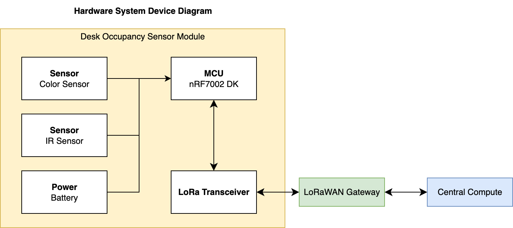
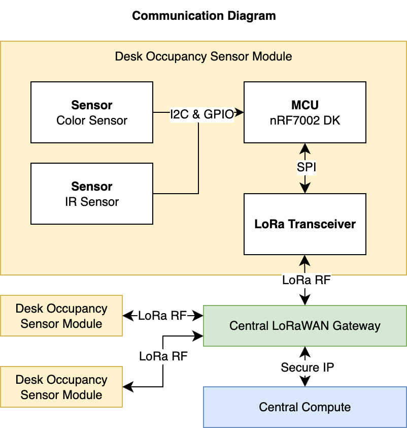

# IoT Venture Pitch

## ESE5180: IoT Wireless, Security, & Scaling

**Team Name: Chicken Nuggets**

| Team Member Name | Email Address           |
| ---------------- | ----------------------- |
| Rohan Panday     | rpanday@seas.upenn.edu  |
| Jason Li         | jasonsli@seas.upenn.edu |
| Nandini Swami    | snandini@seas.upenn.edu |

**GitHub Repository URL:** https://github.com/ese5180/iot-venture-f25-chicken-nuggets#

## Concept Development

### Product Function

In study areas, libraries and coworking places, operations personnel and administrators lack reliable data on the usage of these spaces, notably, how many unique people visit a desk and how long they stay. Existing systems are camera‑based (which comes with privacy issues) or doorway/zone‑level (too coarse for individual desks). Desk-oriented approaches also have a low SNR, which creates vast amounts of data at scale that is hard to process/visualize.

Our solution is a small, under‑desk sensor that detects the presence of an individual and accurately counts unique visitors and time per desk using PIR, ambient/color sensing, and MEMS IR temperature sensors. Connectivity is going to be through LoRaWAN.

### Target Market & Demographics

###### Users

Our primary user is aimed to be the EOS team at Penn, but this kind of product would extrapolate well to other operations individuals who want to know how to plan and develop new spaces. The University, for example, likes to keep tabs on this kind of information when planning for new spaces and shutting down places for renovations. It also helps them know if people are booking places and not using them. EOS has purchased a similar product before, but high amounts of noise and a lack of fit for their use case made the product unusable.

###### Deployment

This could be deployed anywhere in the world, in colleges, office spaces, large facilities, or shared working spaces.

###### Market Analysis

U.S. coworking market: Coworking spaces are estimated to take up a total of [124.8M sq ft](commercialedge.com/wp-content/uploads/sites/75/2024/04/CommercialEdge-Office-National-Report-April-2024.pdf) in the US. Using an estimated rate of 80 to 125 square feet per desk, we can estimate the total number of desks in coworking spaces in the US to be around 1.0–1.6 million.

U.S. higher-ed seating: The total student enrollment of universities across the US is estimated to be about [19 million in 2024](https://educationdata.org/college-enrollment-statistics). Using an estimated rate of around 12 to 25\% to plan for the number of desks across university campuses, we can estimate that universities will need about 2 to 5 million desks to adequately accommodate student and faculty needs.

U.S. TAM (desks) ≈ ~3.3–9.9M. At $50/desk (yr-1) ⇒ ~$165M–$495M.

SAM (higher education): ~2.3–6.3M at $50/desk (yr-1) ⇒ ~$115M-$315M.

SOM:
Year 1: 2,000–5,000 desks deployed → $100k–$250k year-1 revenue (@ $50).
Years 2–3: 20k–50k desks → $1.4–$6.0M ARR-equivalent.

###### Competitor Analysis

Some companies in the space which address occupancy tracking using vision-based solutions are VergeSense and Xovis, which target office occupancy tracking and transportation space such as airports respectively. Other companies such as FreeSpace, XY Sense, Relogix, and Pressac use PIR (passive infrared) based solutions, and are mostly geared towards occupancy tracking in offices for small and open spaces such as desks or meeting rooms. Lastly, more cutting-edge but expensive solutions such as heat tracking sensors from Butlr or radar/time-of-flight sensors from Density.io attempt to push the technology in the space forward.

### Stakeholders

One major stakeholder will be the end user, EOS, at University of Pennsylvania SEAS. We are in communication with the staff at EOS and are meeting with them to discuss how we can partner with them.

Another important stakeholder will be students and faculty, who will be in the vicinity of the product and will be monitored by the device. Privacy is an important consideration, and so making sure students are comfortable with the technology is important.

### System-Level Diagrams

Included below are a hardware system device diagram and a communication diagram:

### Security Requirements Specification

| **ID** | **Category**  | **Requirement**                                                                                                        |
| ------------ | ------------------- | ---------------------------------------------------------------------------------------------------------------------------- |
| SEC 01       | Secure Data Storage | Sensitive data shall be stored securely in the cloud.                                                                        |
| SEC 02       | User Authentication | Users shall authenticate to access cloud storage using secure credentials.                                                   |
| SEC 03       | Local Protection    | Sensitive information on the firmware shall be stored on a secure hardware region on the MCU memory.                         |
| SEC 04       | Data Privacy        | The device shall not capture or transmit personally identifiable information; solely data regarding occupancy shall be sent. |

### Hardware Requirements Specification

| **ID** | **Category**    | **Requirement**                                                                                                                                          |
| ------------ | --------------------- | -------------------------------------------------------------------------------------------------------------------------------------------------------------- |
| HRS 01       | Core Processing Unit  | The system shall be based on the nRF7002 MCU Development Kit.                                                                                                  |
| HRS 02       | Presence Detection    | An IR sensor shall be used to detect human occupant motion within a range of 0.5–1.5 m. The sensor shall communicate with the MCU using I2C or SPI.           |
| HRS 03       | Ambient/Color Sensing | An RGB color sensor or Analog Light Sensor shall be used to differentiate between unique visitors. The sensor shall communicate with the MCU using I2C or SPI. |
| HRS 04       | Connectivity          | The system shall include a LoRa RF transceiver or module to support communication over LoRaWAN. The module shall communicate with the MCU using I2C or SPI.    |
| HRS 05       | Connectivity          | The system shall include a LoRaWAN gateway to communicate with a central compute device over the Internet.                                                     |
| HRS 06       | Power Management      | The hardware shall operate on a battery supply with a target lifetime of ≥6 months on average use.                                                            |

### Software Requirements Specification

| **ID** | **Category**          | **Requirement**                                                                                                           |
| ------------ | --------------------------- | ------------------------------------------------------------------------------------------------------------------------------- |
| SRS 01       | Sensor Data Acquisition     | The MCU firmware shall collect data from the IR sensor, the color sensor, and the temperature sensor at configurable intervals. |
| SRS 02       | Occupancy Session Detection | The MCU firmware shall compute and store session start time, end time, and dwell duration of a person using the space.          |
| SRS 03       | Unique Occupancy            | The MCU firmware shall differentiate between unique occupants using the space and mark each as a separate occupancy session.    |
| SRS 04       | Communication               | The MCU firmware shall transmit occupancy summaries over LoRaWAN to a central compute device at regular intervals.              |
| SRS 05       | Data Visualization          | An application on a central compute device shall aggregate occupancy data and display it to the user in a readable format.      |

### Bootloader and FOTA

Overview:

We implemented Device Firmware Update (DFU) over UART . First, we enabled MCUboot as the secure bootloader and configured it for single-slot mode to support serial recovery. This allowed firmware updates through UART using tools like AuTerm and mcumgr, letting us reflash the board without using a debugger. We then extended the setup to support DFU from the application, switching to dual-slot mode so updates could be performed while the main app ran.

Next, we added custom signing keys for MCUboot using imgtool.py to ensure only trusted firmware could be installed, replacing the default development key. Finally, we enabled external SPI flash as the secondary image slot, increasing available storage for larger applications. 

The bootloader occupies 32 KB of flash, from address 0x00000 – 0x07FFF. The application occupies roughly 1 MB of flash (0xF8000 bytes), from address 0x08000 – 0x0FFFFF. The application handles DFU via UART (MCUboot only verifies and swaps).

Downloaded firmware images are written to the secondary slot defined in sysbuild.conf: SB_CONFIG_PM_EXTERNAL_FLASH_MCUBOOT_SECONDARY=y. That secondary slot lives on the board’s external SPI NOR flash (MX25R64), allowing large image storage beyond the 1 MB internal flash.

Enabled protections include:

* Digital-signature verification (ECDSA-P256) → rejects unsigned or modified images.
* CRC and metadata validation → detects corrupted transfers.
* Dual-slot fallback → MCUboot boots the last known-good image if the new one fails validation.
* Serial-recovery mode → allows re-flashing via UART even if both slots are invalid.
* External-flash isolation → prevents a failed image from overwriting the running firmware.

Wireless Communication:

Our team explored several wireless communication options for firmware-over-the-air (FOTA) updates on the nRF7002 DK. Initially, we considered performing FOTA over LoRaWAN, since it aligns with the communication protocol used in our main project. However, after researching existing implementations and documentation, we found that LoRaWAN’s low data rate and payload size limitations make it impractical for large firmware transfers.

Next, we experimented with Wi-Fi-based FOTA (exercise 7). We attempted to integrate cloud-based FOTA through Memfault and later AWS IoT, but both presented challenges — Memfault’s documentation was outdated for our SDK version, and AWS integration introduced code conflicts with our existing LoRaWAN stack. Currently, we are experimenting with Bluetooth Low Energy (BLE) FOTA. BLE offers a reliable and relatively lightweight communication channel for local updates and may proven easier to integrate with MCUboot compared to cloud-based Wi-Fi solutions.

### MVP DEMO:

For our MVP demo, we have used several sensors and integrated many of the features required in order to make 